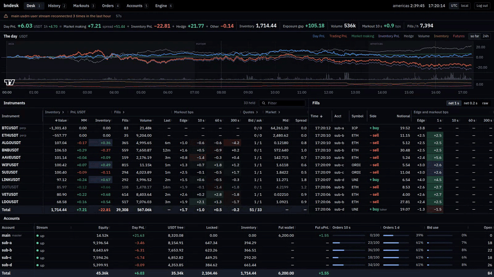
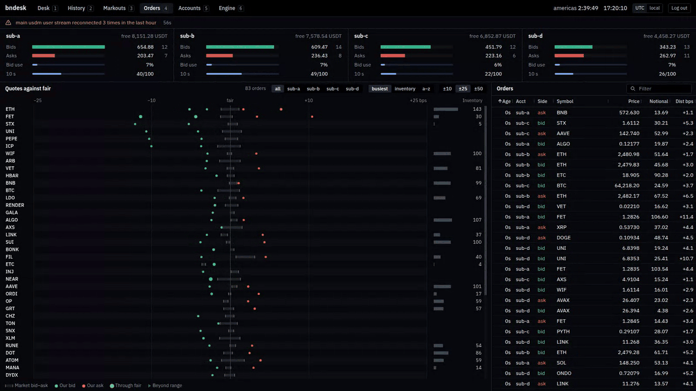

# bndesk

**[Live demo](https://ziy.bio/bndesk/)**

A high-performance, real-time dashboard for high-frequency market making on Binance, written in Rust and especially designed for [FastMM](https://github.com/ziyangliu-666/FastMM).

## Features

- Live P&L, split into market making, inventory, hedge and other
- Fill quality: edge and markouts for every fill, by market and by hour
- Quote map: every resting order against fair value and the book
- Inventory, exposure and hedge across spot and USD-M futures
- Master and sub-accounts in one view
- History with candles, volume and daily breakdowns
- Trading engine metrics over Prometheus, and alerts
- Read-only by design

## Built for speed

- One async Rust server (tokio, axum) holds all live state in memory
- Only changes go to the browser, as compressed binary WebSocket frames
- Charts and grids render on canvas and virtualized rows

[Setup](docs/setup.md) | [Pages](docs/pages.md) | [Design](DESIGN.md) | [Security](SECURITY.md) | MIT
