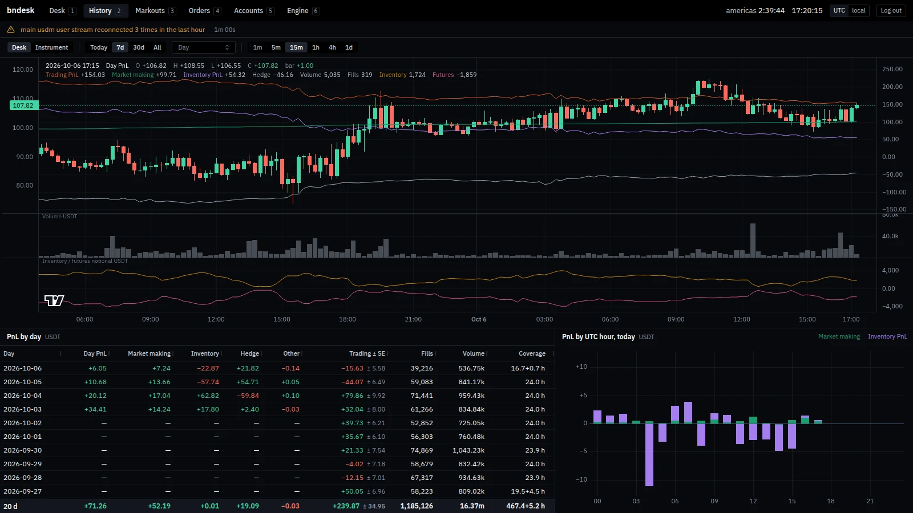
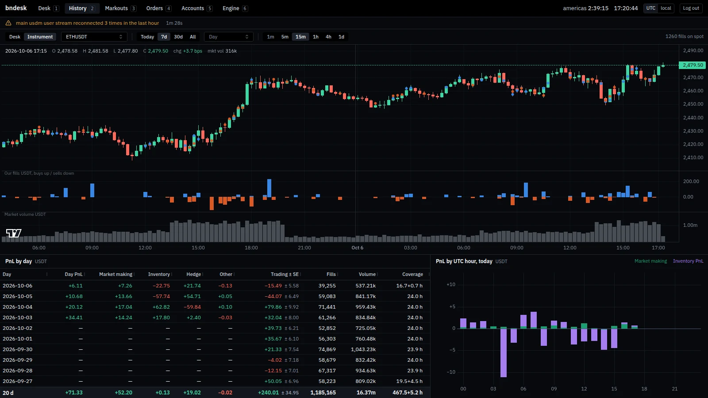
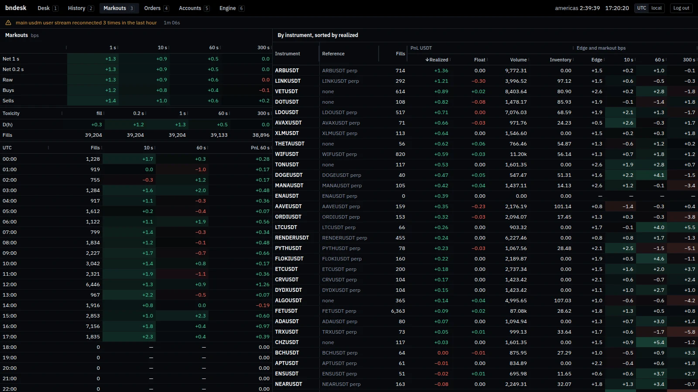
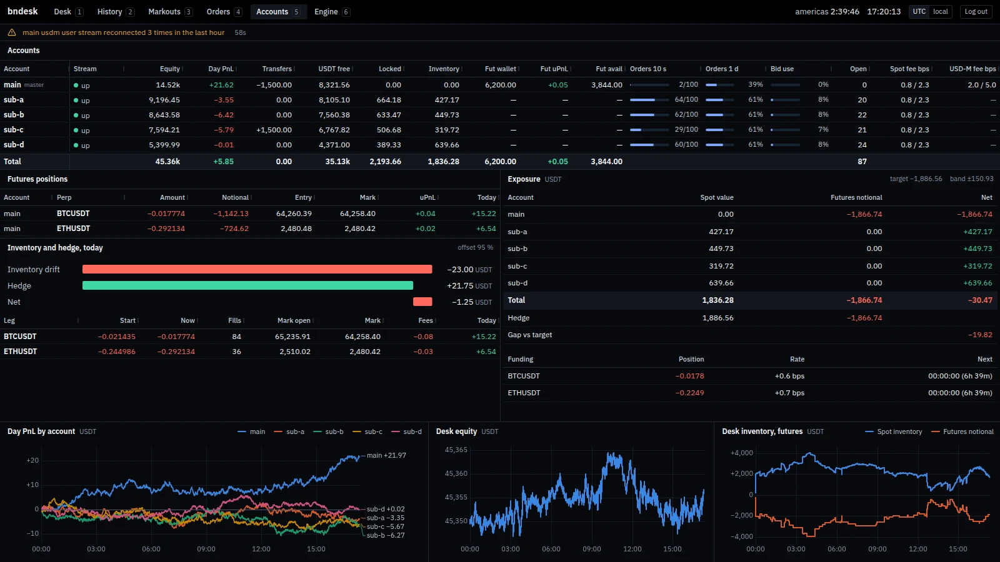
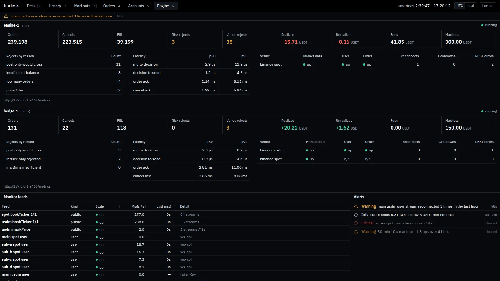

# The pages

## Desk

The page you keep open. Day P&L is split into market making, inventory, hedge and whatever those three do not explain, so a gap in the books shows up as a number. Below it are the day chart, the instruments you hold or quote, the latest fills and the accounts.

## History

Days and weeks of P&L as candles, with volume and inventory underneath and a table that splits each day the way the Desk splits today.

Switched to one instrument, it shows the market's klines with your fills on them.

## Markouts

How the price moved after your fills, how much of the edge survived, and which hours and markets did well.

## Orders

Your resting quotes against fair value and the market's bid and ask, next to each account's order-rate usage.

## Accounts

Balances, futures positions, the exposure and the hedge.

## Engine

Your trading engine's own metrics, scraped from a Prometheus endpoint, along with the desk's connections and alerts.

